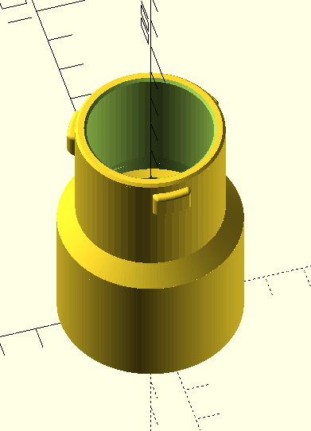
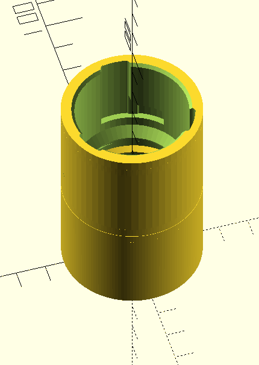
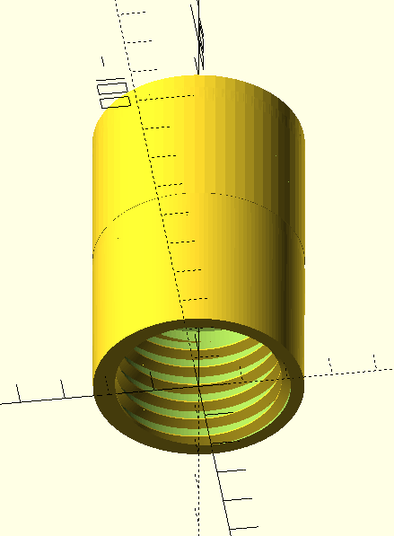
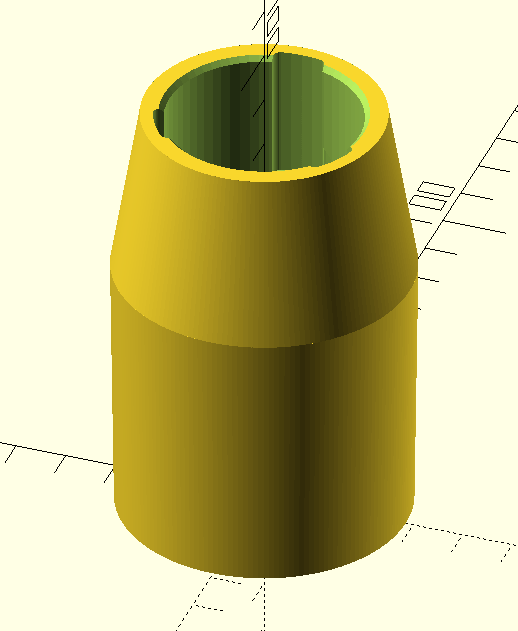
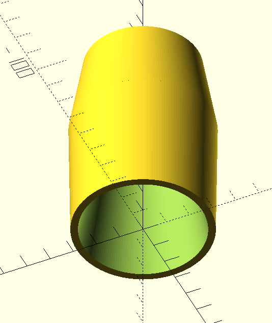
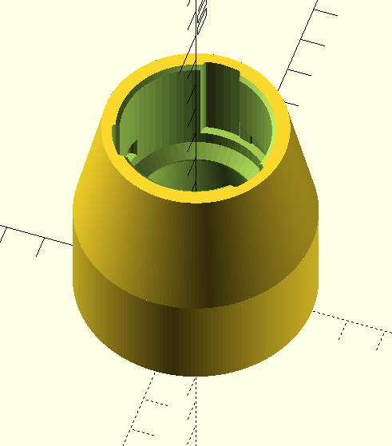
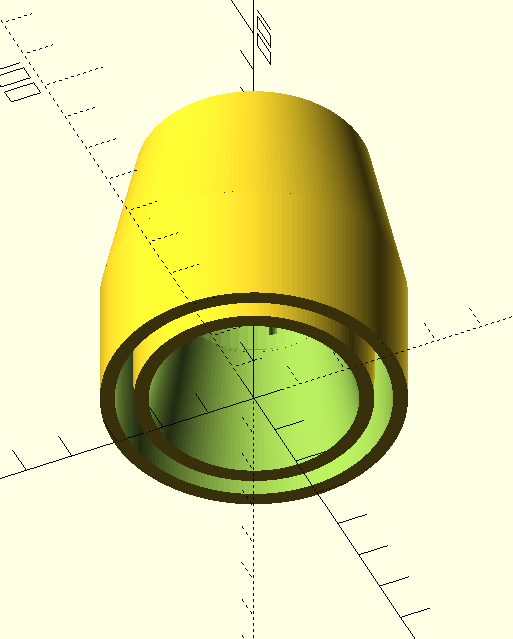
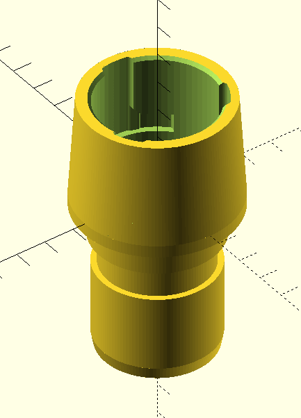
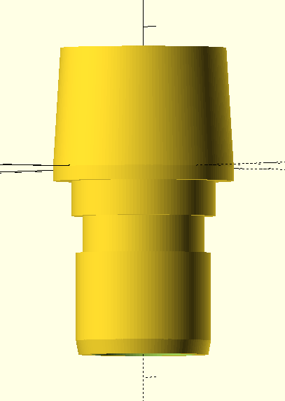

# Parametrisierbare OSVAC adapter

Meist kann die Dicke, Wandstärke und ggf weitere Parameter in OpenSCAD eingestellt werden.

## Schlauch

Gewindesteigung etc kann auf verschiedene Spiralschläuche angepasst werden.

## Staubsauger

Kann in den Schlauchanschluss von Staubsaugern gesteckt werden. Der "Pfropf" ist
leicht konisch und kann in der Dicke angepasst werden.

## Rohr

Ähnlich, kann auf Rohre gesteckt werden. Der Zwischenraum, in dem das Rohr verschwindet,
ist leicht zulaufend und kann in den Maßen angepasst werden. Geht in männlich und weiblich.

## Nilfisk

Adaptiert das Klicksystem an den Rohrenden der Nilfisk-Sauger auf OSVAC-female.

